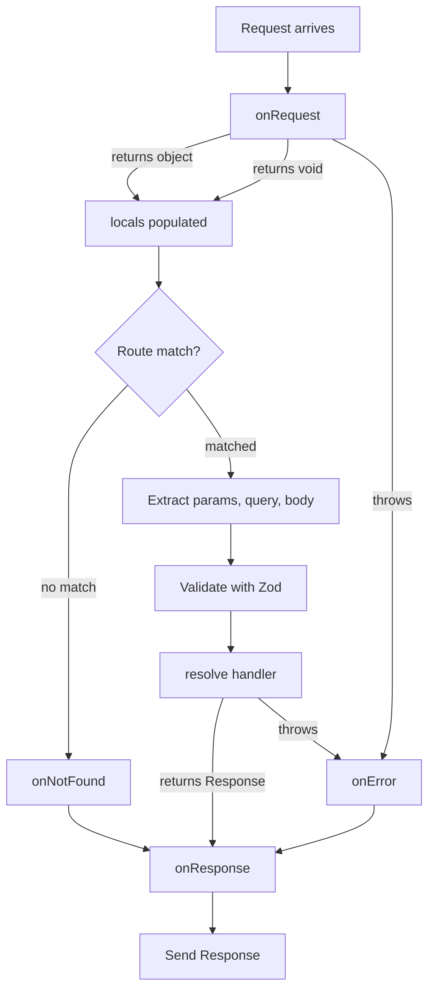
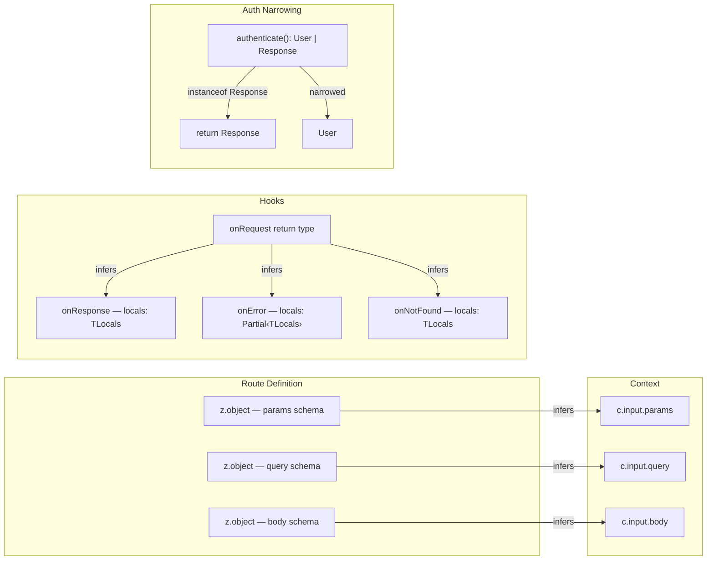
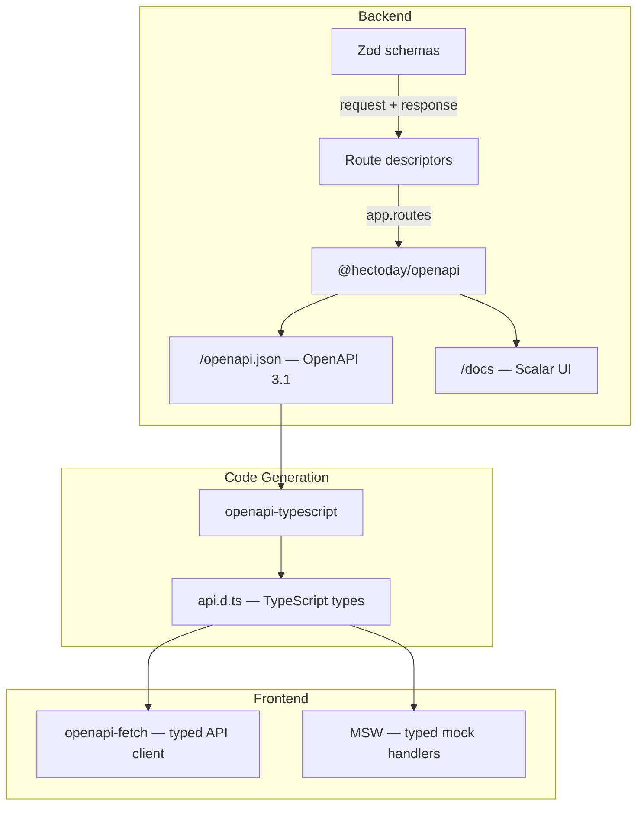

# Diagrams

## 1. Request Lifecycle

```mermaid
flowchart TD
    A[Request arrives] --> B[onRequest]
    B --> |returns object| C[locals populated]
    B --> |returns void| C
    B --> |throws| H[onError]
    C --> D{Route match?}
    D --> |no match| E[onNotFound]
    D --> |matched| F[Extract params, query, body]
    F --> G[Validate with Zod]
    G --> I[resolve handler]
    I --> |returns Response| J[onResponse]
    I --> |throws| H
    H --> J
    E --> J
    J --> K[Send Response]
```

## 2. Type Flow

```mermaid
flowchart LR
    subgraph Route Definition
        ZP[z.object — params schema]
        ZQ[z.object — query schema]
        ZB[z.object — body schema]
    end

    subgraph Context
        ZP --> |infers| CP[c.input.params]
        ZQ --> |infers| CQ[c.input.query]
        ZB --> |infers| CB[c.input.body]
    end

    subgraph Hooks
        OR[onRequest return type] --> |infers| L1[onResponse — locals: TLocals]
        OR --> |infers| L2[onError — locals: Partial‹TLocals›]
        OR --> |infers| L3[onNotFound — locals: TLocals]
    end

    subgraph Auth Narrowing
        AUTH["authenticate(): User | Response"] --> |instanceof Response| EARLY[return Response]
        AUTH --> |narrowed| USER[User]
    end
```

## 3. OpenAPI Toolchain

```mermaid
flowchart TD
    subgraph Backend
        ZOD[Zod schemas] --> |request + response| RD[Route descriptors]
        RD --> |app.routes| OA["@hectoday/openapi"]
        OA --> SPEC["/openapi.json — OpenAPI 3.1"]
        OA --> DOCS["/docs — Scalar UI"]
    end

    subgraph Code Generation
        SPEC --> OTS[openapi-typescript]
        OTS --> TYPES["api.d.ts — TypeScript types"]
    end

    subgraph Frontend
        TYPES --> CLIENT["openapi-fetch — typed API client"]
        TYPES --> MSW["MSW — typed mock handlers"]
    end
```
